# TODO app

This is a basic to-do list implemented with an N-tier architecture.

* MySQL database
* PHP backend API
* Javascript frontend ([Vue JS][vue-todo])

This is also commonly referred to as the [LAMP stack][lamp].

## Table of Contents

1. [Provision Open Stack Server Virtual Hardware (Linux on Nebula)](#provision-virtual-machine)
1. [Install Web Server (Apache)]
1. [Install Database Management System Software (MySQL)](#install-mysql)
    1. [Harden Security](#harden-security)
    1. [Deploy Application Physical Schema](#deploy-application-physical-schema)
        1. [Create Database](#create-database)
        1. [Execute DDL](#define-schema)
        1. [Provision User Accounts](#create-users)
        1. [Authorize User Accounts](#grant-permissions)
1. [Install PHP]
    1. [Deploy Application Web Service]

## Provision Virtual Machine

You will need access to a private server.
The University IT Services provides this at no cost for students.

Login: https://nebula.uark.edu

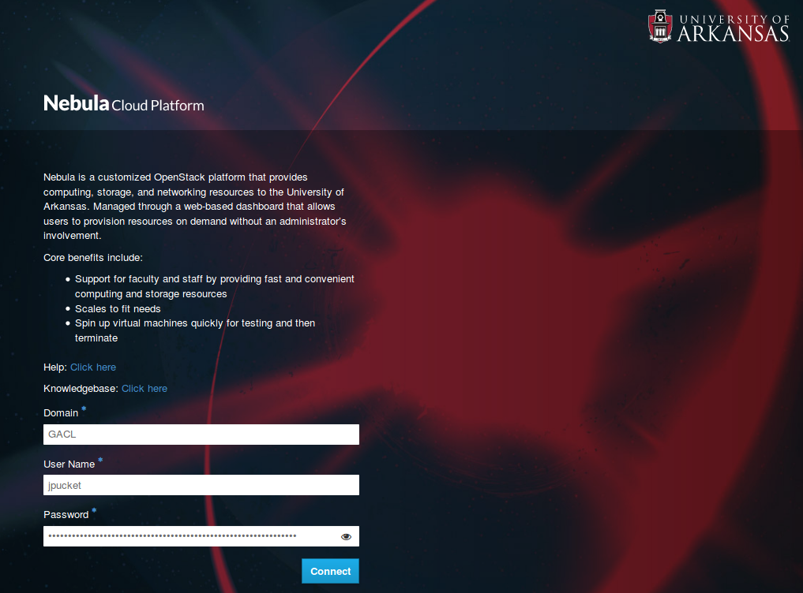

> **If your password doesn't work,**
> then you will need to request access [here][nebula-account-request].
> Fill out the form with all the defaults to request a nebula account,
> and then wait until they respond creating your account.

Click on <kbd>Launch Instance</kbd>

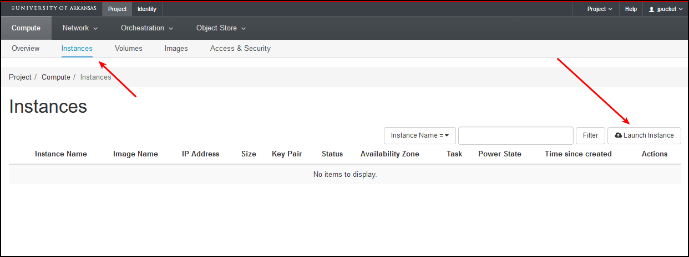

Click on <kbd>Details</kbd> and name the server `todoserver`

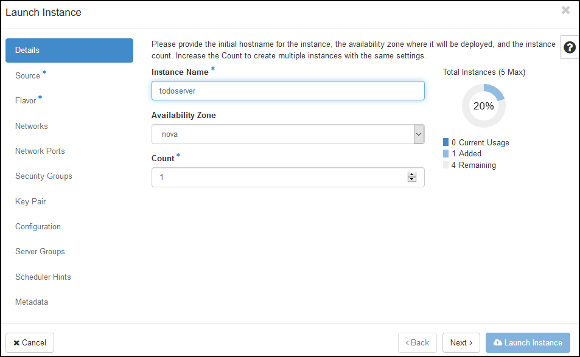

Click on <kbd>Source</kbd> and choose `Image` from `Select Boot Source`

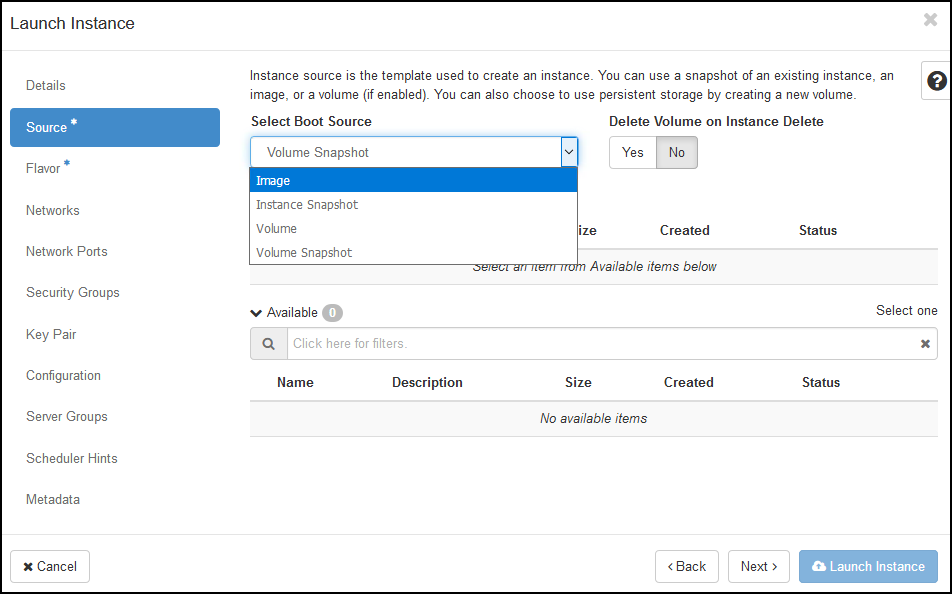

Choose the `Ubuntu16.04-LTS` image by clicking the respective <kbd>+</kbd>

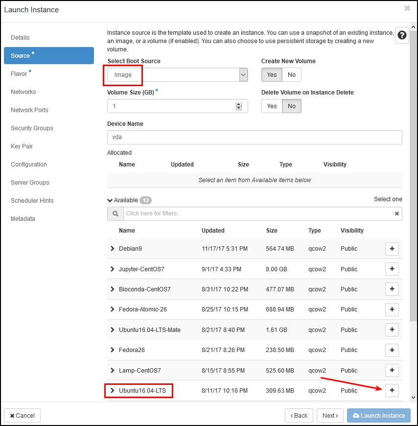

Click <kbd>Flavor</kbd> and choose the `m1.tiny`

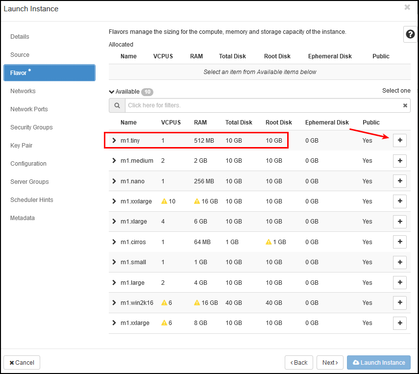

We will need a way to login to the server.
This is accomplished through [SSH][ssh] and [public-private key pair cryptography][pki].
It's like creating a cryptographic lock on the server to which we have a key.

Click <kbd>Key Pair</kbd> and then <kbd>+ Create Key Pair</kbd>

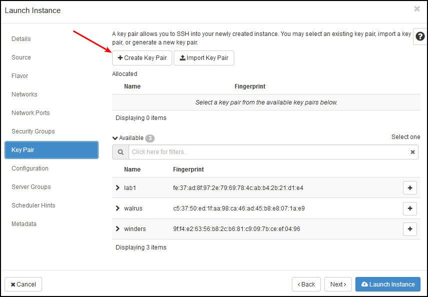

Name it `todoserver` and click <kbd>Create Keypair</kbd>

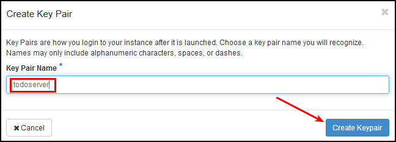

Finally, click <kbd>Launch Instance</kbd>

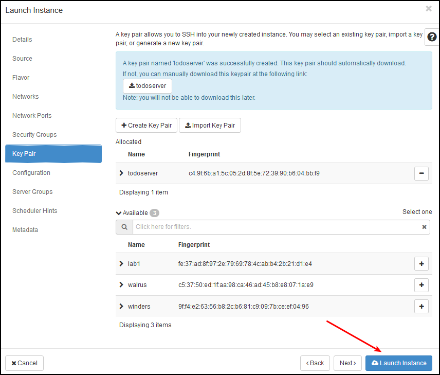

In order to make the server accessible to our network,
we need to associate a LAN IP address.

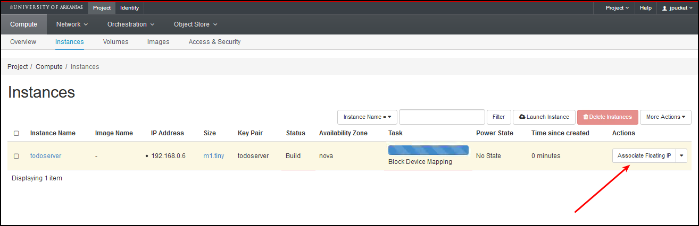

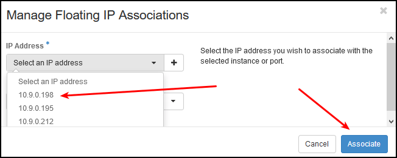

At last, verify that the server is running on the 10.0.0.0/8 network.

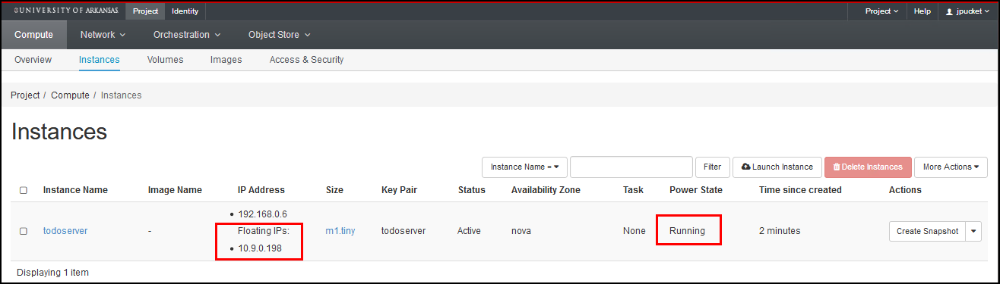

## Install MySQL

    sudo apt install -y mysql-server

When prompted, choose a `root` user password, and write it down.

Once installation has finished, login to the console client.

    mysql --user root --password

When prompted, enter the password for `root` that you just created.

Now you are able to write and execute SQL.
For example, show a list of all databases:

    SHOW DATABASES;

All you should see at this point are system databases
because we haven't created any yet.
In order to switch to a database namespace context, use a `USE` statement.

    USE mysql;

Now you can view a list of all tables in that database.

    SHOW TABLES;

When you are finished exploring the data, exit the program.

    quit

### Harden Security

Run the secure installation script:

    mysql_secure_installation

You will be presented with a series of questions.

> Would you like to setup VALIDATE PASSWORD plugin?

    yes

> There are three levels of password validation policy:  
>
> LOW    Length >= 8  
> MEDIUM Length >= 8, numeric, mixed case, and special characters  
> STRONG Length >= 8, numeric, mixed case, special characters and dictionary  
>
> Please enter level of password validation policy.

A minimum password length of 8 characters [is not good enough][your-password-is-too-damn-short],
but don't worry right now because we'll fix this later.

    2

> Change the password for root?

    yes

Choose an awesome password for `root` and write it down somewhere safe.

> Remove anonymous users?

    yes

> Disallow root login remotely?

    yes

> Remove test database and access to it?

    yes

> Reload privilege tables now?

    yes

Now we can login to the client and check our [password validation options][password-validate-options].

    mysql -u root -p

```sql
SHOW VARIABLES LIKE 'validate_password%';
```

As was [mentioned earlier][your-password-is-too-damn-short],
we need to increase the minimum password length to *at least* 13.

Remember, a short, but wild mix of random characters is much easier to crack
than a long string of lowercase letters.

[![xkcd cartoon on password strength][password-strength]][password-strength-xkcd]

Passwords are out! Passphrases are in!

*Note* one caveat with MySQL Replication limits password lengths to a
[maximum of 32 characters][password-max].

Lastly, if you really want to step up your infosec game,
then add a [dictionary][password-dictionary].

In order to persist these settings after reboot,
they need to be saved in the service configuration file.
Edit the daemon configuration file to set startup variables.

    sudo vim /etc/mysql/mysql.conf.d/mysqld.cnf

At the bottom of the file, add the following lines:

```bash
# password cannot be username
validate_password_check_user_name=ON
# minimum password length
validate_password_length=13
validate_password_policy=STRONG
```

Restart the daemon to load your changes.

    sudo service mysql restart

### Deploy Application Physical Schema

#### Create Database

Provision a database on the server using [`CREATE DATABASE` syntax][create-database].

```sql
CREATE DATABASE todoapp CHARACTER SET utf8mb4 COLLATE utf8mb4_unicode_520_ci;
```

See also: [choosing a collation][choosing-collation].

#### Define Schema

Execute the [data definition language][ddl] for the application.

    mysql -u root -p todoapp < sql/ddl.sql

#### Create Users

Provision a user account on the server using [`CREATE USER` syntax][create-user].

```sql
CREATE USER jeff IDENTIFIED BY 'ISYS4283 is the best!';
```

#### Grant Permissions

Authorize access using [`GRANT` syntax][grant-syntax]
following the [principle of least privilege][least-privilege-principle].

```sql
GRANT SELECT ON todoapp.view_todos TO jeff;
GRANT SELECT (id) ON todoapp.todos TO jeff;
GRANT INSERT ON todoapp.todos TO jeff;
GRANT UPDATE ON todoapp.todos TO jeff;
GRANT DELETE ON todoapp.todos TO jeff;
```

If you would like to create an administrative user,
then `GRANT ALL PRIVILEGES` with an asterisk wildcard for entities.

```sql
GRANT ALL PRIVILEGES ON todoapp.* TO 'adminuser'@'localhost';
```

[vue-todo]:https://vuejs.org/v2/examples/todomvc.html
[lamp]:https://en.wikipedia.org/wiki/LAMP_%28software_bundle%29
[nebula-account-request]:https://help.uark.edu/CherwellPortal/ITHelpPortal/Command/OneStep.LaunchOneStep?Name=Nebula%20Request
[ssh]:https://en.wikipedia.org/wiki/Secure_Shell
[pki]:https://en.wikipedia.org/wiki/Public_key_infrastructure
[your-password-is-too-damn-short]:https://blog.codinghorror.com/your-password-is-too-damn-short/
[password-validate-options]:https://dev.mysql.com/doc/refman/5.7/en/validate-password-options-variables.html
[password-strength]:./docs/images/password-strength.png
[password-strength-xkcd]:https://xkcd.com/936/
[password-max]:https://stackoverflow.com/a/31634299/4233593
[password-dictionary]:https://dev.mysql.com/doc/refman/5.7/en/validate-password-options-variables.html#sysvar_validate_password_dictionary_file
[create-database]:https://dev.mysql.com/doc/refman/5.7/en/create-database.html
[choosing-collation]:https://stackoverflow.com/a/38363567/4233593
[ddl]:./sql/ddl.sql
[create-user]:https://dev.mysql.com/doc/refman/5.7/en/create-user.html
[grant-syntax]:https://dev.mysql.com/doc/refman/5.7/en/grant.html
[least-privilege-principle]:https://en.wikipedia.org/wiki/Principle_of_least_privilege
